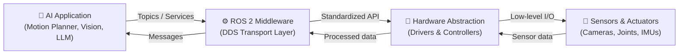
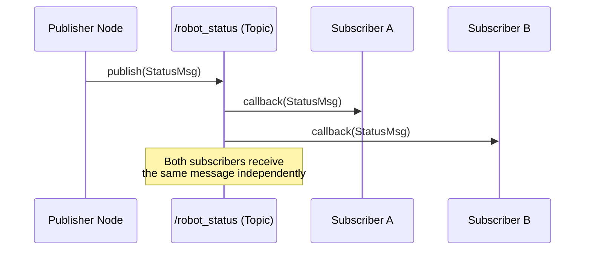
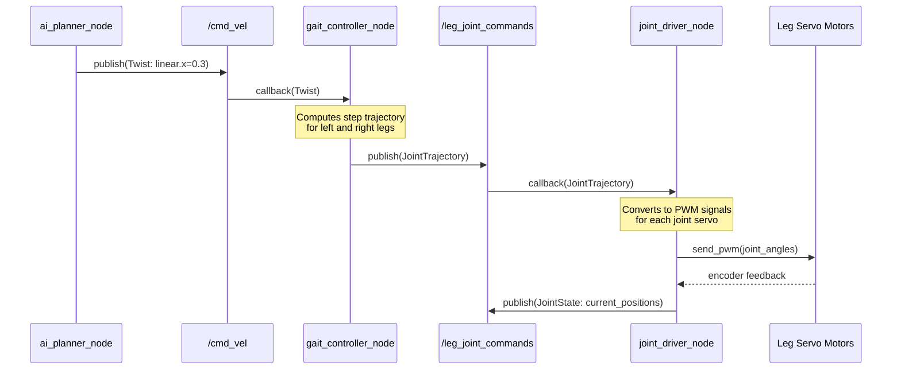

# Chapter 1 — Introduction to ROS 2 and the Robotic Nervous System

## Learning Objectives

By the end of this chapter you will be able to:

- Define **middleware** and explain its role in connecting software to hardware in a robotic system
- Explain why **ROS 2** is preferred over custom-built middleware in modern humanoid robotics
- Describe the **ROS 2 architecture**, including the role of the DDS transport layer
- Explain how **nodes** communicate using **topics** and typed **messages**

---

## What is Middleware?

Imagine a humanoid robot with 30 joints, 10 cameras, a microphone array, a force
sensor in each fingertip, and an AI reasoning system running on a separate compute
board. Every one of these components speaks a slightly different language — different
data rates, different protocols, different APIs.

**Middleware** is the software layer that sits between hardware drivers and
application software, providing a common communication fabric so that all these
components can talk to each other without each one needing to know the implementation
details of the others.

Think of middleware as a **postal system** for robot components:

- **Components** are like buildings with addresses (named endpoints).
- **Messages** are like letters with typed formats (you can't send a parcel where
  an envelope is expected).
- **Topics** are like postal routes — any component can drop a letter on a route,
  and any interested component can pick it up.

Without middleware, every new sensor or actuator would require custom integration
code with every other component — a combinatorial explosion of interfaces. Middleware
eliminates this by providing a single, standard communication bus.

---

## Why ROS 2?

ROS 2 (Robot Operating System 2) is the open-source middleware framework that has
become the industry standard for professional robotics development. It is not an
operating system in the traditional sense — it runs on top of Linux, Windows, or
macOS — but it provides the communication, tool, and library ecosystem that robotic
systems depend on.

### Key Advantages Over Alternatives

| Advantage | Description |
|---|---|
| **DDS transport** | Built on Data Distribution Service — an industrial, real-time pub/sub standard |
| **Real-time support** | Supports deterministic, low-latency communication for safety-critical joints |
| **Multi-platform** | Runs on Linux, Windows, macOS, and embedded systems (via micro-ROS) |
| **Rich ecosystem** | Thousands of ready-made packages for perception, planning, and control |
| **Security (SROS2)** | Built-in encrypted, authenticated communication for production deployments |
| **Multi-language** | Client libraries for Python (`rclpy`), C++ (`rclcpp`), Rust, and others |

### Why Not ROS 1?

ROS 1 (the original Robot Operating System) had a single point of failure: a central
broker called `rosmaster`. If it crashed, the entire system stopped. ROS 2 eliminates
the central broker entirely — every node discovers peers directly using DDS, making
the system resilient and suitable for real deployments.

:::info Target version
All examples in this module target **ROS 2 Humble Hawksbill (LTS)**, supported
until May 2027 and the most widely deployed ROS 2 release.
:::

---

## ROS 2 Architecture Overview

ROS 2 is organized in four conceptual layers:

### The Four Layers Explained

**1. AI Application Layer**
Your AI code — motion planners, object detectors, language models — runs here.
It communicates with the rest of the system exclusively through ROS 2 interfaces,
with no knowledge of the underlying hardware.

**2. ROS 2 Middleware (DDS)**
The heart of the system. DDS (Data Distribution Service) is a peer-to-peer
publish-subscribe protocol. Nodes discover each other automatically on the
network — no central broker required. DDS handles message serialization,
QoS (Quality of Service) policies, and transport reliability.

**3. Hardware Abstraction Layer**
ROS 2 hardware drivers translate between the standardized ROS 2 message format
and the actual hardware protocol (CAN bus, SPI, USB, Ethernet). This layer
means an AI application can switch from a simulated robot to a real one by
changing configuration, not code.

**4. Sensors & Actuators**
The physical world: joint servos, cameras, LiDAR, microphones, force-torque sensors.
These generate raw data that the hardware abstraction layer packages into ROS 2
messages.

---

## Nodes, Topics, and Message Passing

### Nodes

A **node** is a single-purpose computational process in a ROS 2 system. Each node
does one well-defined job:

- `camera_driver_node` — reads frames from a camera and publishes them
- `object_detector_node` — subscribes to camera frames and publishes detected objects
- `motion_planner_node` — subscribes to object detections and publishes motion commands
- `joint_controller_node` — subscribes to motion commands and drives servo motors

Nodes are independently runnable processes. They can be written in Python or C++,
and they communicate exclusively through the ROS 2 middleware — they never call
each other's functions directly.

### Topics

A **topic** is a named, typed communication channel. Nodes publish messages to a
topic, and any number of other nodes can subscribe to receive those messages.

Topics are:
- **Named**: e.g., `/camera/image_raw`, `/joint_states`, `/cmd_vel`
- **Typed**: every message on a topic must be of the declared message type (e.g., `sensor_msgs/Image`)
- **Asynchronous**: publishers do not wait for subscribers; messages flow continuously

### Message Passing

This publish-subscribe pattern means:
- A publisher can have zero, one, or many subscribers — it doesn't need to know
- A subscriber can listen to a topic without the publisher knowing
- Multiple publishers can publish to the same topic (e.g., two cameras → one `/images` topic)

---

## Real-World Example: Humanoid Walking Command Flow

Let's trace a walking command from an AI motion planner to the robot's leg joints,
illustrating how ROS 2 nodes and topics work together in practice.

**Scenario**: An AI planner decides the robot should take one step forward.

**Three nodes, three responsibilities**:

1. **`ai_planner_node`**: Publishes a `Twist` message (linear and angular velocity)
   to the `/cmd_vel` topic. It has no knowledge of joint mechanics.

2. **`gait_controller_node`**: Subscribes to `/cmd_vel`, computes the leg joint
   trajectory needed to achieve that velocity, and publishes a `JointTrajectory`
   message to `/leg_joint_commands`.

3. **`joint_driver_node`**: Subscribes to `/leg_joint_commands`, converts joint
   angle targets to PWM signals for the servo motors, and publishes the actual
   joint positions back as `JointState` messages for other nodes to monitor.

Each node is replaceable independently. Swap the gait controller for a different
walking algorithm, and the AI planner and hardware driver remain unchanged.

---

## Summary

| Concept | Key Takeaway |
|---|---|
| **Middleware** | Software layer enabling standardized communication between all robot components |
| **ROS 2** | Open-source robotic middleware built on DDS; the industry standard for modern robots |
| **DDS** | Data Distribution Service — a peer-to-peer transport that eliminates the need for a central broker |
| **Node** | A single-purpose computational process that communicates exclusively through ROS 2 interfaces |
| **Topic** | A named, typed communication channel; publishers write to it, subscribers read from it |
| **Message** | A typed data structure published to a topic; enforces data contracts between nodes |
| **Publish-Subscribe** | Asynchronous pattern where publishers and subscribers are decoupled — neither knows the other |
