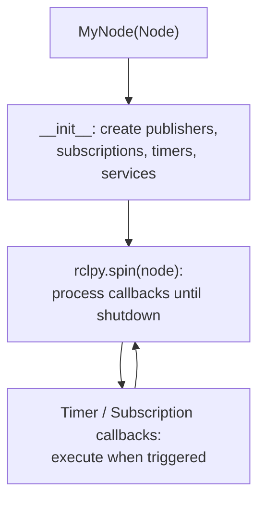
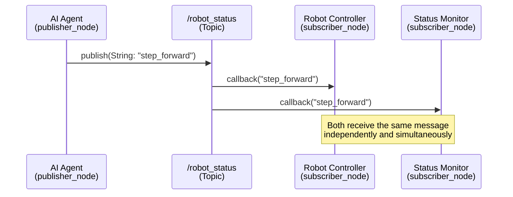
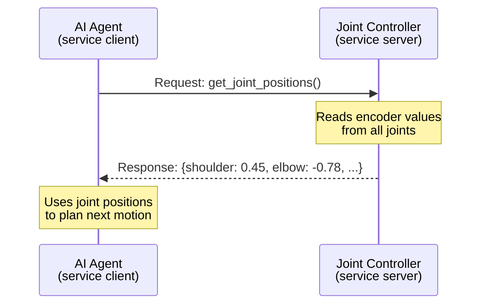
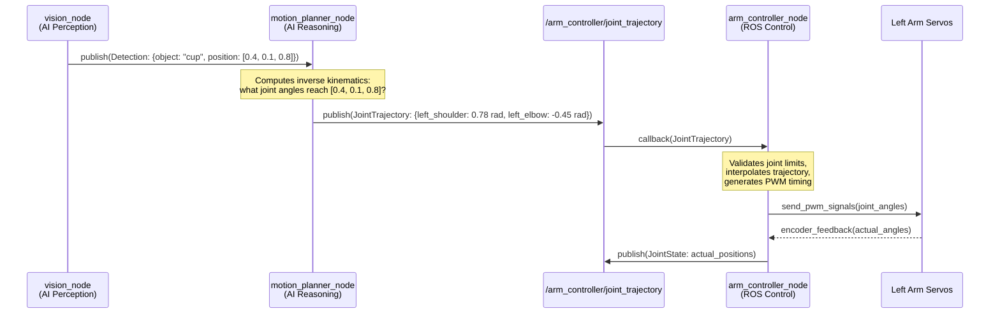

# Chapter 2 — ROS 2 Communication Model

:::note Prerequisites
This chapter builds on **Chapter 1** concepts — nodes, topics, and message passing.
[Review Chapter 1](./chapter-1-intro) if any of those terms are unfamiliar before continuing.
:::

## Learning Objectives

By the end of this chapter you will be able to:

- Implement a **publisher node** and a **subscriber node** in Python using `rclpy`
- Explain the difference between **topics** (asynchronous streaming) and **services** (synchronous request-response)
- Trace how an **AI agent decision** becomes a ROS 2 message delivered to a robot controller
- Understand **node naming conventions** and how nodes form a communication graph

---

## Understanding Nodes

### Nodes as Python Classes

In ROS 2 Python (`rclpy`), every node is a class that inherits from `rclpy.node.Node`.
The node's constructor calls `super().__init__('node_name')` to register it with the
ROS 2 graph under a unique name.



### Node Lifecycle

1. **Initialize** — `rclpy.init()` starts the ROS 2 client library
2. **Create node** — Instantiate your `Node` subclass; publishers and subscriptions register
3. **Spin** — `rclpy.spin(node)` blocks and processes incoming messages and timer callbacks
4. **Shutdown** — `rclpy.shutdown()` cleanly closes connections

### Node Naming and Namespaces

Nodes are identified by a hierarchical name:

- Simple name: `camera_driver`
- Namespaced: `/robot1/camera_driver`
- Fully qualified: `/robot1/camera_driver` (with leading `/`)

Namespacing lets you run multiple robots on the same network without name conflicts.
You can inspect all running nodes with the command `ros2 node list`.

---

## Topics: Publishers and Subscribers

Topics are asynchronous — a publisher sends messages without waiting for anyone to
receive them, and subscribers receive messages without the publisher knowing.



### Publisher Node Example

```python title="publisher_node.py" showLineNumbers
# ROS 2 Humble - rclpy publisher example

import rclpy                          # Core ROS 2 Python library
from rclpy.node import Node           # Base class for all ROS 2 nodes
from std_msgs.msg import String       # Standard string message type


class MinimalPublisher(Node):
    """A node that publishes a status message every second."""

    def __init__(self):
        # Register this node with ROS 2 under the name 'minimal_publisher'
        super().__init__('minimal_publisher')

        # Create a publisher on the '/robot_status' topic
        # String = message type, queue_size=10 stores up to 10 undelivered messages
        self.publisher_ = self.create_publisher(String, 'robot_status', 10)

        # Create a timer that fires every 1.0 seconds and calls timer_callback
        timer_period = 1.0
        self.timer = self.create_timer(timer_period, self.timer_callback)

        # Counter to track how many messages have been sent
        self.count = 0

    def timer_callback(self):
        """Called every second — builds and publishes one message."""
        msg = String()                            # Create an empty String message
        msg.data = f'Robot status: step {self.count}'  # Fill in the message payload
        self.publisher_.publish(msg)              # Send the message to the topic

        # Log the sent message to the console for debugging
        self.get_logger().info(f'Publishing: "{msg.data}"')
        self.count += 1                           # Increment step counter


def main(args=None):
    rclpy.init(args=args)            # Initialize the ROS 2 Python client library

    node = MinimalPublisher()        # Create an instance of our publisher node
    rclpy.spin(node)                 # Block here, processing callbacks until shutdown

    node.destroy_node()             # Clean up node resources
    rclpy.shutdown()                # Shut down the ROS 2 client library


if __name__ == '__main__':
    main()
```

### Subscriber Node Example

```python title="subscriber_node.py" showLineNumbers
# ROS 2 Humble - rclpy subscriber example

import rclpy                          # Core ROS 2 Python library
from rclpy.node import Node           # Base class for all ROS 2 nodes
from std_msgs.msg import String       # Must match the publisher's message type


class MinimalSubscriber(Node):
    """A node that listens to the robot_status topic and logs received messages."""

    def __init__(self):
        # Register this node under the name 'minimal_subscriber'
        super().__init__('minimal_subscriber')

        # Subscribe to the 'robot_status' topic
        # When a message arrives, listener_callback is automatically called
        self.subscription = self.create_subscription(
            String,                    # Message type — must match the publisher
            'robot_status',            # Topic name — must match the publisher
            self.listener_callback,    # Function to call when a message arrives
            10                         # Queue size — buffer up to 10 messages
        )

    def listener_callback(self, msg):
        """Called automatically each time a message arrives on the topic."""
        # Log the received message content to the console
        self.get_logger().info(f'Received: "{msg.data}"')


def main(args=None):
    rclpy.init(args=args)            # Initialize the ROS 2 Python client library

    node = MinimalSubscriber()       # Create an instance of our subscriber node
    rclpy.spin(node)                 # Block here, waiting for messages to arrive

    node.destroy_node()             # Clean up node resources
    rclpy.shutdown()                # Shut down the ROS 2 client library


if __name__ == '__main__':
    main()
```

:::tip Running the examples
In a ROS 2 Humble environment, open two terminals:
- Terminal 1: `python publisher_node.py`
- Terminal 2: `python subscriber_node.py`

You'll see the subscriber printing each message the publisher sends.
:::

---

## Services: Request-Response Communication

Topics are ideal for continuous data streams (sensor readings, status updates).
But sometimes you need a direct question-and-answer interaction — for that, ROS 2
provides **services**.

A service has:
- A **server** node that listens for requests and sends responses
- A **client** node that sends a request and waits for the response



### Topics vs Services — When to Use Each

| | Topics | Services |
|---|---|---|
| **Pattern** | Publish-Subscribe | Request-Response |
| **Synchrony** | Asynchronous | Synchronous (client waits) |
| **Best for** | Streaming data (sensors, status) | Queries with expected answers |
| **Example** | Camera frames, joint states | "Get current position", "Set speed limit" |
| **Overhead** | Low — fire and forget | Higher — client blocks until response |

---

## AI Agent and ROS Controller Interaction

Here is how a complete AI decision becomes a physical robot action, traced
step by step through the ROS 2 communication model.

**Scenario**: An AI vision model detects an object on a table and decides the
robot should extend its left arm to reach it.



### Separation of Concerns

This architecture enforces three clean layers of responsibility:

1. **AI Layer** (`vision_node`, `motion_planner_node`): Handles reasoning.
   It knows *what* to do and *where* to go — but not *how* to move joints.

2. **ROS 2 Layer** (topics, services, message types): Handles communication.
   Encodes the decision as a typed message and delivers it reliably.

3. **Hardware Layer** (`arm_controller_node`, servo drivers): Handles execution.
   Translates abstract joint angles into electrical signals — with no knowledge
   of why the motion was requested.

This separation means you can replace the AI planner, swap the robot hardware, or
add new sensors without rewriting the other layers. Each layer communicates only
through ROS 2 interfaces.

---

## Summary

| Concept | Key Takeaway |
|---|---|
| **Node** | A Python class inheriting from `rclpy.node.Node`; runs as an independent process |
| **Publisher** | Created with `create_publisher(MsgType, topic_name, queue_size)` |
| **Subscriber** | Created with `create_subscription(MsgType, topic_name, callback, queue_size)` |
| **Topic** | Asynchronous, named channel — best for streaming data |
| **Service** | Synchronous request-response — best for queries with expected answers |
| **rclpy** | The ROS 2 Python client library; provides `Node`, `spin()`, `init()`, `shutdown()` |
| **QoS** | Quality of Service — configures reliability, history depth, and durability per topic |
