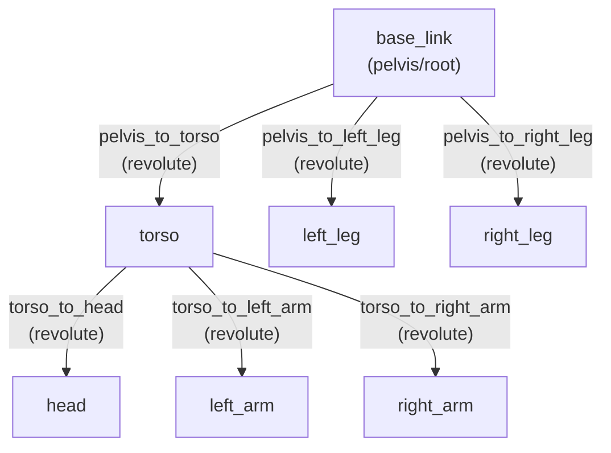
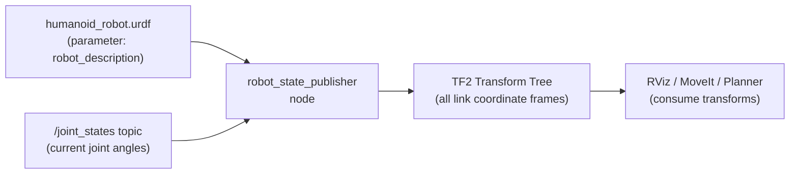

# Chapter 3 — Robot Structure and Description (URDF)

:::note Prerequisites
This chapter assumes familiarity with ROS 2 nodes and topics from
[Chapter 1](./chapter-1-intro) and the Python communication model from
[Chapter 2](./chapter-2-communication).
:::

## Learning Objectives

By the end of this chapter you will be able to:

- Define **URDF** and explain its role as a robot's structural blueprint
- Identify and interpret `<link>` and `<joint>` XML elements in a URDF file
- Read a **humanoid robot URDF** and trace the complete link-joint hierarchy
- Explain how **`robot_state_publisher`** and **TF2** use URDF within ROS 2

---

## What is URDF?

A humanoid robot is a machine with dozens of rigid body parts connected by movable
joints — a torso, two arms, two legs, a head. Before any software can plan motions,
detect collisions, or display the robot in a visualizer, it needs to know the robot's
geometry: How long is the forearm? Where does the shoulder joint attach to the torso?
How far can the knee bend?

**URDF** (Unified Robot Description Format) is the standard XML format used across
the ROS 2 ecosystem to answer these questions. A URDF file is the robot's **blueprint**:
a complete description of every rigid segment, every joint, and every physical property.

URDF is used by:
- **`robot_state_publisher`** — to compute and broadcast coordinate frame transforms
- **RViz** — to visualize the robot in 3D
- **MoveIt** — for motion planning and collision checking
- **Gazebo / Isaac Sim** — for physics simulation

Every tool in the ROS 2 ecosystem reads URDF from a common parameter; swap the URDF
file and all tools automatically use the new robot description.

---

## Links and Joints

A URDF file is built from two fundamental elements: **links** and **joints**.

### Links — Rigid Body Segments

A `<link>` element represents one rigid, non-deformable segment of the robot body:
a forearm, a torso plate, a camera mount. Each link has a name and can optionally
define its visual shape, collision geometry, and inertial properties.

```xml title="link_example.urdf"
<!-- A simplified link: just a box-shaped torso segment -->
<link name="torso">
  <visual>
    <geometry>
      <!-- A box: 0.3m wide, 0.5m tall, 0.2m deep -->
      <box size="0.3 0.5 0.2"/>
    </geometry>
  </visual>
</link>
```

### Joints — Connections Between Links

A `<joint>` element connects two links — a **parent** and a **child** — and defines
how they move relative to each other.

Every joint specifies:
- `type` — the motion the joint allows (see table below)
- `<parent link="...">` — the upstream link in the kinematic chain
- `<child link="...">` — the downstream link
- `<origin>` — the position and orientation of the child link relative to the parent

### Joint Types

| Type | Motion | Body Example |
|---|---|---|
| `fixed` | No motion — rigidly attached | Skull to head plate; camera to head |
| `revolute` | Rotation around one axis with min/max limits | Shoulder, knee, elbow, hip |
| `continuous` | Unlimited rotation (no limits) | Wheel axle, wrist roll |
| `prismatic` | Linear sliding motion with limits | Spine height extension |

```xml title="joint_example.urdf"
<!-- A revolute joint connecting torso (parent) to left_arm (child) -->
<joint name="torso_to_left_arm" type="revolute">
  <parent link="torso"/>
  <child link="left_arm"/>
  <!-- Child's origin: 0.2m to the left and 0.2m up from the parent's origin -->
  <origin xyz="-0.2 0.0 0.2" rpy="0 0 0"/>
  <!-- Rotation limits in radians: -90 to +90 degrees -->
  <limit effort="100.0" velocity="1.0" lower="-1.5707" upper="1.5707"/>
  <!-- Rotation axis: around the Y axis (side-to-side arm raise) -->
  <axis xyz="0 1 0"/>
</joint>
```

---

## Humanoid Robot Representation

A humanoid robot maps naturally to a tree of links connected by joints, rooted
at the pelvis (`base_link`). The tree branches outward to the extremities.



Each arrow represents a joint. The label shows the joint name and type. Notice:

- `base_link` is the **root** — all other links are children or descendants
- The torso connects to the head, both arms, but the **legs connect directly to the pelvis**
  (as in human anatomy — the legs are not attached to the torso)
- Every joint is `revolute` in this simplified model — each represents a rotation

---

## Sample URDF: Simplified Humanoid

The complete URDF below describes a seven-link humanoid robot with six joints.
Every element is commented to explain its purpose.

```xml title="humanoid_robot.urdf" showLineNumbers
<?xml version="1.0"?>
<!-- URDF for a simplified 7-link humanoid robot -->
<!-- ROS 2 Humble compatible -->
<robot name="simple_humanoid">

  <!-- ============================================================ -->
  <!-- LINKS: one per rigid body segment                            -->
  <!-- ============================================================ -->

  <!-- Root link: the pelvis, anchored to the world -->
  <link name="base_link">
    <visual>
      <geometry>
        <!-- Pelvis: 0.2m wide, 0.1m tall, 0.15m deep -->
        <box size="0.2 0.1 0.15"/>
      </geometry>
    </visual>
  </link>

  <!-- Torso: the main upper body segment -->
  <link name="torso">
    <visual>
      <geometry>
        <!-- Torso: 0.3m wide, 0.5m tall, 0.2m deep -->
        <box size="0.3 0.5 0.2"/>
      </geometry>
    </visual>
  </link>

  <!-- Head: mounted on top of torso -->
  <link name="head">
    <visual>
      <geometry>
        <!-- Head: sphere with 0.1m radius -->
        <sphere radius="0.1"/>
      </geometry>
    </visual>
  </link>

  <!-- Left arm: single segment for simplicity -->
  <link name="left_arm">
    <visual>
      <geometry>
        <!-- Left arm: 0.08m wide, 0.35m long, 0.08m deep -->
        <box size="0.08 0.35 0.08"/>
      </geometry>
    </visual>
  </link>

  <!-- Right arm: mirror of left arm -->
  <link name="right_arm">
    <visual>
      <geometry>
        <box size="0.08 0.35 0.08"/>
      </geometry>
    </visual>
  </link>

  <!-- Left leg: single segment for simplicity -->
  <link name="left_leg">
    <visual>
      <geometry>
        <!-- Left leg: 0.1m wide, 0.5m long, 0.1m deep -->
        <box size="0.1 0.5 0.1"/>
      </geometry>
    </visual>
  </link>

  <!-- Right leg: mirror of left leg -->
  <link name="right_leg">
    <visual>
      <geometry>
        <box size="0.1 0.5 0.1"/>
      </geometry>
    </visual>
  </link>

  <!-- ============================================================ -->
  <!-- JOINTS: one per connection between links                     -->
  <!-- ============================================================ -->

  <!-- Pelvis to torso: vertical lift out of the pelvis center -->
  <joint name="pelvis_to_torso" type="revolute">
    <parent link="base_link"/>
    <child link="torso"/>
    <!-- Torso sits 0.3m above the pelvis center -->
    <origin xyz="0 0 0.3" rpy="0 0 0"/>
    <!-- Torso can tilt forward/backward slightly (lumbar flex) -->
    <limit effort="200.0" velocity="1.0" lower="-0.3" upper="0.3"/>
    <axis xyz="0 1 0"/>
  </joint>

  <!-- Torso to head: neck joint, sits at top of torso -->
  <joint name="torso_to_head" type="revolute">
    <parent link="torso"/>
    <child link="head"/>
    <!-- Head origin: 0.3m above the torso center -->
    <origin xyz="0 0 0.3" rpy="0 0 0"/>
    <!-- Head can nod forward/backward (pitch) -->
    <limit effort="50.0" velocity="2.0" lower="-0.5" upper="0.5"/>
    <axis xyz="0 1 0"/>
  </joint>

  <!-- Torso to left arm: left shoulder joint -->
  <joint name="torso_to_left_arm" type="revolute">
    <parent link="torso"/>
    <child link="left_arm"/>
    <!-- Left shoulder: 0.2m to the left, 0.15m below the torso top -->
    <origin xyz="-0.2 0.0 0.15" rpy="0 0 0"/>
    <!-- Shoulder raises from side (0) to overhead (pi/2) -->
    <limit effort="150.0" velocity="1.5" lower="-1.5707" upper="1.5707"/>
    <axis xyz="0 1 0"/>
  </joint>

  <!-- Torso to right arm: right shoulder joint (mirror of left) -->
  <joint name="torso_to_right_arm" type="revolute">
    <parent link="torso"/>
    <child link="right_arm"/>
    <!-- Right shoulder: 0.2m to the right, 0.15m below the torso top -->
    <origin xyz="0.2 0.0 0.15" rpy="0 0 0"/>
    <limit effort="150.0" velocity="1.5" lower="-1.5707" upper="1.5707"/>
    <axis xyz="0 1 0"/>
  </joint>

  <!-- Pelvis to left leg: left hip joint -->
  <joint name="pelvis_to_left_leg" type="revolute">
    <parent link="base_link"/>
    <child link="left_leg"/>
    <!-- Left hip: 0.1m to the left, 0.3m below the pelvis center -->
    <origin xyz="-0.1 0.0 -0.3" rpy="0 0 0"/>
    <!-- Hip swings forward/backward for walking -->
    <limit effort="300.0" velocity="2.0" lower="-0.8" upper="0.8"/>
    <axis xyz="0 1 0"/>
  </joint>

  <!-- Pelvis to right leg: right hip joint (mirror of left) -->
  <joint name="pelvis_to_right_leg" type="revolute">
    <parent link="base_link"/>
    <child link="right_leg"/>
    <!-- Right hip: 0.1m to the right, 0.3m below the pelvis center -->
    <origin xyz="0.1 0.0 -0.3" rpy="0 0 0"/>
    <limit effort="300.0" velocity="2.0" lower="-0.8" upper="0.8"/>
    <axis xyz="0 1 0"/>
  </joint>

</robot>
```

---

## Integration with ROS 2

Once a URDF file is written, three ROS 2 nodes bring it to life at runtime.

### `robot_state_publisher`

This node reads the URDF from the `robot_description` ROS 2 parameter and continuously
computes the coordinate frame transform for every link based on the current joint
positions. It publishes these transforms to the **TF2** system.



### `joint_state_publisher`

When no real hardware is connected (during development or simulation), this node
publishes synthetic joint positions to the `/joint_states` topic, allowing
`robot_state_publisher` to compute and broadcast transforms as if the robot were
moving. It can open a GUI slider panel for manually setting joint angles.

### TF2 — The Transform Library

**TF2** (Transform Library version 2) maintains a tree of coordinate frames over
time. Any node can query: *"Where is the left_hand frame relative to the torso frame,
right now?"* — and TF2 answers using the published transforms.

This is critical for:
- **Motion planning**: knowing where a hand is in 3D space relative to an object
- **Perception**: knowing which camera captured a detection and converting its
  coordinates to the robot's base frame
- **Visualization**: RViz uses TF2 to draw every link in the correct position

```bash title="launch_robot_description.bash"
# Load a URDF into robot_state_publisher using a ROS 2 launch command
# (requires ROS 2 Humble to be sourced)

ros2 run robot_state_publisher robot_state_publisher \
  --ros-args -p robot_description:="$(cat humanoid_robot.urdf)"
```

---

## Summary

| Concept | Key Takeaway |
|---|---|
| **URDF** | XML format that describes a robot's complete geometry, kinematics, and physical properties |
| **Link** | A rigid body segment (XML element: `link`) — arms, legs, head, torso |
| **Joint** | A connection between two links (XML element: `joint`) with types: revolute, fixed, continuous, prismatic |
| **robot_state_publisher** | ROS 2 node that reads URDF and publishes TF2 coordinate frame transforms |
| **joint_state_publisher** | ROS 2 node that simulates joint positions for development and visualization |
| **TF2** | ROS 2 transform library; any node can query where any link is in 3D space at any time |
| **Link hierarchy** | URDF is a tree rooted at `base_link`; joints define parent-child relationships |
