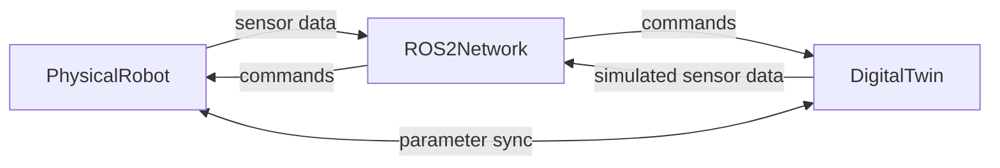
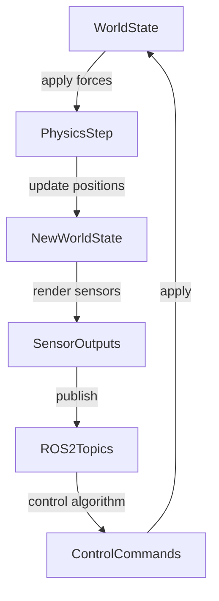

# Chapter 1: Physics Simulation with Gazebo

## Learning Objectives

By the end of this chapter you will be able to:

- Define a digital twin and explain how it mirrors a physical robot
- Describe the four physics properties Gazebo simulates: gravity, collisions, inertia, and friction
- Read an annotated Gazebo SDF world file and identify its key sections
- Explain the feedback loop between a physical robot and its digital twin

---

:::info Prerequisites

This chapter requires:

- **Module 1 -- ROS 2 Foundations**: ROS 2 topics and the publisher/subscriber model

:::

---

## What is a Digital Twin?

A **digital twin** is a software model that mirrors a physical system in real time. For a humanoid robot, the digital twin replicates:

- **Geometry**: the robot's links, joints, and dimensions
- **Dynamics**: how the robot moves under forces (gravity, motor torques, external contacts)
- **Sensors**: the data streams the robot's sensors produce

The digital twin is not just a 3D model -- it is a live simulation that runs in parallel with (or before) the real robot. You develop software against the twin, validate it in simulation, and only then deploy to hardware.

---

## Why Simulate?

Three reasons make simulation essential in robotics:

1. **Safety**: A software bug that causes a simulated robot to fall costs nothing. The same bug on real hardware can damage the robot, its surroundings, or bystanders.
2. **Speed**: You can run a simulation faster than real time (10x, 100x) to accelerate testing.
3. **Reproducibility**: A simulation produces identical results for the same inputs. Real-world conditions -- lighting, floor friction, air currents -- vary between runs.

---

## Gazebo: A Physics Simulator

**Gazebo** is the standard open-source physics simulator for ROS 2 development. It models the physical forces that govern how a robot moves and interacts with its environment. Gazebo integrates natively with ROS 2: sensors publish to ROS 2 topics, actuators subscribe to ROS 2 topics, and the simulation time is published on `/clock`.

### The Four Physics Properties Gazebo Simulates

**Gravity**: The downward acceleration (9.81 m/s squared) that pulls all bodies in the simulation. Without accurate gravity, a bipedal humanoid would float or fall in unrealistic ways.

**Collisions**: When two rigid bodies contact each other, Gazebo computes contact forces and prevents them from interpenetrating. Collision geometry is usually a simplified convex hull of the visual mesh -- full mesh collision is too expensive to compute at real-time rates.

**Inertia**: The resistance of a body to changes in its rotational state. Each link in the robot model has an inertia tensor that determines how it responds to torques. Inaccurate inertia values are a common source of divergence between simulation and real hardware.

**Friction**: The tangential force between contacting surfaces. Gazebo models friction using Coulomb's law: friction force = friction coefficient x normal force. Wheel-ground friction determines whether a wheeled robot slips; foot-ground friction determines whether a bipedal robot can push off to walk.

---

## The Gazebo World File (SDF)

Gazebo worlds are defined in **SDF (Simulation Description Format)**, an XML-based file format. A minimal world file looks like this:

```xml
<?xml version="1.0" ?>
<sdf version="1.9">
  <!-- The world element is the root of the simulation -->
  <world name="robot_lab">

    <!-- Physics plugin: sets the simulation step and gravity -->
    <plugin name="gz-sim-physics-system"
            filename="gz-sim-physics-system">
    </plugin>

    <!-- A flat ground plane for the robot to stand on -->
    <model name="ground_plane">
      <static>true</static>
      <link name="link">
        <collision name="collision">
          <geometry><plane><normal>0 0 1</normal></plane></geometry>
        </collision>
      </link>
    </model>

    <!-- Include your robot model from a separate URDF or SDF file -->
    <include>
      <uri>model://my_humanoid_robot</uri>
      <pose>0 0 1.0  0 0 0</pose>
    </include>

  </world>
</sdf>
```

Key elements:
- `world name`: the simulation namespace; used when launching multiple worlds.
- `plugin`: loads a Gazebo system plugin. The physics plugin is required for any simulation.
- `model name="ground_plane"`: a static (non-moving) plane that provides a floor.
- `include uri`: loads a robot model by URI. The `pose` sets the robot's starting position (x y z roll pitch yaw).

:::note
In prose and table cells, XML tag names must be written in backticks (e.g., `world`, `model`, `include`) to comply with MDX v3 parsing rules. Bare angle brackets are not allowed outside of fenced code blocks.
:::

---

## The Digital Twin Feedback Loop



Both the physical robot and the digital twin publish sensor data to the same ROS 2 topics and subscribe to the same command topics. This means the same software stack -- navigation, perception, planning -- can run unchanged against either the real robot or its simulation.

---

## The Simulation Loop



Each simulation step (typically 1 ms): compute forces, update positions, render sensor data, publish to ROS 2, receive control commands, repeat. The physics step size and the ROS 2 publish rate are independent settings -- sensor data is usually published at 10--50 Hz while the physics step runs at 1000 Hz.

---

## Gazebo Plugins

Gazebo plugins extend the simulator with additional functionality. For humanoid robots, the most commonly used plugins are:

| Plugin | Purpose | ROS 2 Output |
|---|---|---|
| gz-sim-sensors-system | Processes all sensor models in the world | Varies by sensor type |
| gz-sim-physics-system | Runs the physics engine (ODE/Bullet/DART) | None (internal) |
| gz-sim-ros2-control | Bridges Gazebo joints to ros2_control | `/joint_states`, `/cmd_vel` |
| gz-sim-user-commands-system | Allows external commands to move models | None (internal) |

---

## Summary

| Term | Definition |
|---|---|
| Digital Twin | A software replica that mirrors a physical robot's geometry, dynamics, and sensors |
| Gazebo | Open-source physics simulator that integrates natively with ROS 2 |
| SDF | Simulation Description Format -- the XML file format for Gazebo world and model definitions |
| Gravity | 9.81 m/s squared downward acceleration applied to all non-static bodies |
| Inertia | A link's resistance to changes in rotational motion; defined per link in the robot model |
| Friction | Tangential contact force computed as friction coefficient times normal force |
| Gazebo Plugin | A shared library that extends Gazebo with sensors, physics, or ROS 2 bridges |

---

**Next**: [Chapter 2 -- High-Fidelity Environments with Unity →](./chapter-2-unity.md)
