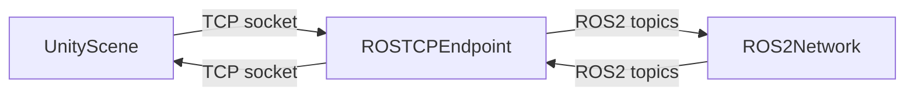

# Chapter 2: High-Fidelity Environments with Unity

## Learning Objectives

By the end of this chapter you will be able to:

- Explain why Unity is used for HRI research when Gazebo is already available
- Compare Gazebo and Unity across five key dimensions using the comparison table
- Describe the Unity scene hierarchy and explain how GameObjects and Components are used to build a robot environment
- Explain how ROS-TCP-Connector bridges Unity and ROS 2 for bidirectional topic communication

---

:::info Prerequisites

This chapter requires:

- **Chapter 1 (this module)**: Gazebo physics simulation concepts and the digital twin definition
- **Module 1 -- ROS 2 Foundations**: ROS 2 topics and publishers

:::

---

## Why Unity for Robotics?

Gazebo is the standard tool for physics-accurate robot simulation. But it was designed for functional testing, not for visual fidelity. When you need a simulation environment that looks convincing to a human participant -- for Human-Robot Interaction (HRI) studies, photorealistic perception training, or user experience research -- Gazebo's visual quality is often insufficient.

**Unity** is a real-time 3D engine used in games, films, and architecture visualization. It renders high-fidelity environments with physically-based materials, global illumination, and real-time shadows. For HRI research, this matters: a study participant interacting with a robot in a photorealistic room will behave differently (and more naturally) than one interacting in Gazebo's grey, textureless world.

Unity also excels at building **interactive scenarios**: you can script dynamic events (a human actor who walks through a doorway, a cup that falls off a table) and control them from ROS 2 topics.

---

## Gazebo vs Unity: Choosing Your Simulator

| Dimension | Gazebo | Unity |
|---|---|---|
| Physics accuracy | High (ODE/Bullet/DART engine) | Medium (PhysX engine, less tuneable) |
| Visual fidelity | Low (basic materials, no global illumination) | High (PBR materials, real-time GI, HDR) |
| ROS 2 integration | Native (gz-ros2-control, sensor plugins) | Via ROS-TCP-Connector bridge |
| HRI and UX research | Limited (not convincing to human participants) | Excellent (photorealistic, interactive) |
| Sensor simulation | Excellent (LiDAR, camera, IMU plugins) | Limited (basic camera; no LiDAR plugin) |

**When to use Gazebo**: functional robot testing, sensor simulation, Nav2 integration, controller tuning.

**When to use Unity**: HRI studies, photorealistic perception training data, interactive scenario scripting, UI/UX research with human participants.

The two tools are complementary, not competing.

---

## The Unity Scene Hierarchy

Unity organizes a scene as a tree of **GameObjects**. Every object in the scene -- a robot, a table, a light, a camera -- is a GameObject. Behavior is added by attaching **Components** to GameObjects.

```text
Scene (robot_lab)
|-- Environment
|   |-- Floor (MeshRenderer, MeshCollider)
|   |-- Walls (MeshRenderer, MeshCollider)
|   `-- Table (MeshRenderer, MeshCollider, Rigidbody)
|-- Robot
|   |-- Base (MeshRenderer, ArticulationBody)
|   |-- LeftArm (MeshRenderer, ArticulationBody)
|   |-- RightArm (MeshRenderer, ArticulationBody)
|   `-- Head
|       |-- Camera (Camera component, CameraPublisher)
|       `-- Display (MeshRenderer, TextMeshPro)
|-- ROSConnection (ROSConnection component)
`-- Lighting
    |-- DirectionalLight
    `-- AmbientProbe
```

Key components for robotics:
- `ArticulationBody`: Unity's physics component for robotic joints (replaces Rigidbody for articulated chains).
- `MeshCollider`: enables collision detection for a mesh.
- `ROSConnection`: the root component of the ROS-TCP-Connector bridge.
- `CameraPublisher`: a ROS-TCP-Connector script that publishes camera images to a ROS 2 topic.

---

## ROS-TCP-Connector: Bridging Unity and ROS 2

**ROS-TCP-Connector** (Unity Robotics Hub) is an open-source Unity package that creates a TCP socket connection between Unity and a running ROS 2 system. It supports bidirectional communication: Unity can publish to ROS 2 topics and subscribe to them.

How it works:
1. A **ROS TCP Endpoint** node runs inside ROS 2. It acts as a relay: it forwards messages from Unity to the ROS 2 network and vice versa.
2. Inside Unity, the `ROSConnection` component manages the socket connection.
3. Publisher and subscriber scripts in Unity use the `ROSConnection` API to send and receive typed ROS 2 messages.



The TCP bridge introduces a small latency overhead (typically 1--5 ms on localhost). For HRI research this is imperceptible. For hard real-time control loops it is not suitable -- use Gazebo with native ros2_control for those.

---

## An HRI Scenario: Robot Meets Human

Consider this HRI research scenario: a humanoid robot must approach a seated participant, make eye contact, and hand them an object. In Gazebo, this looks like a robot-shaped grey capsule approaching a pink box. In Unity:

- The environment is a photorealistic living room with furniture, lighting, and textures.
- The human participant model has articulated limbs, facial expressions, and idle animations.
- The robot model uses the same URDF as the real hardware, rendered with PBR materials.
- A Python script publishes to `/scenario_event` to trigger the participant to look up when the robot reaches a waypoint.

The study participant, watching this scenario through a VR headset, experiences a convincing social interaction. The data collected -- gaze direction, response time, comfort ratings -- is meaningful because the stimulus is ecologically valid.

---

## Summary

| Term | Definition |
|---|---|
| Unity | Real-time 3D engine used for high-fidelity robot simulation and HRI research |
| HRI | Human-Robot Interaction -- research area studying how humans and robots communicate and collaborate |
| GameObject | The fundamental entity in a Unity scene; all objects (robot, table, light) are GameObjects |
| Component | A behavior or property attached to a GameObject (e.g., MeshRenderer, ArticulationBody) |
| ArticulationBody | Unity physics component for robotic joints in an articulated chain |
| ROS-TCP-Connector | Unity Robotics Hub package that bridges Unity to ROS 2 via a TCP socket |

---

**Next**: [Chapter 3 -- Simulating Robot Sensors →](./chapter-3-sensors.md)
