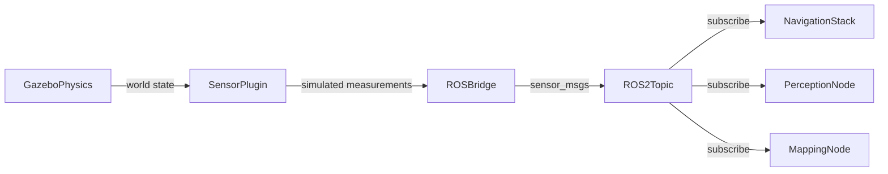
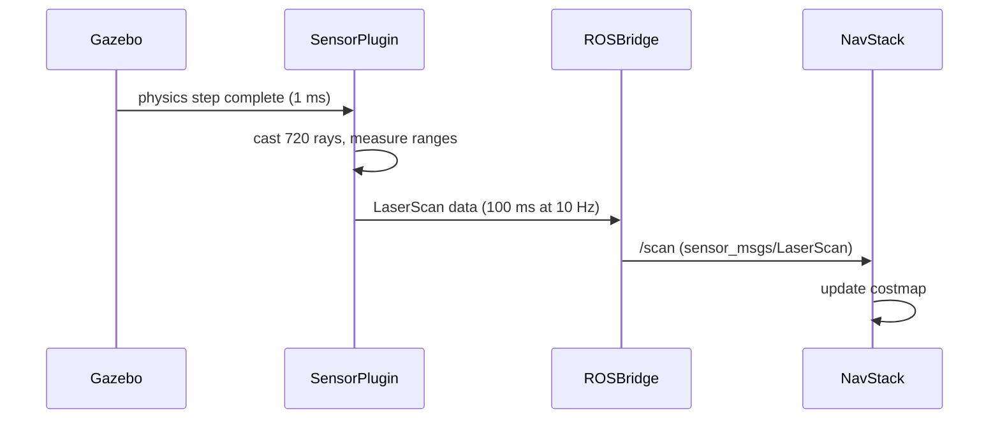

# Chapter 3: Simulating Robot Sensors

## Learning Objectives

By the end of this chapter you will be able to:

- Explain why simulating sensors is necessary before deploying software to real hardware
- Name the ROS 2 message types for LiDAR, RGBD camera, and IMU sensor data and the topics they publish on
- Read a minimal Gazebo sensor plugin configuration and identify its key fields
- Trace simulated sensor data from a Gazebo plugin through a ROS 2 topic to a subscriber node

---

:::info Prerequisites

This chapter requires:

- **Module 1 -- ROS 2 Foundations**: ROS 2 topics, publishers, and message types (`sensor_msgs`)
- **Chapter 1 (this module)**: Gazebo simulation concepts and the SDF world format

:::

---

## Why Simulate Sensors?

Real robot sensors are expensive, fragile, and produce data that depends on uncontrolled environmental conditions (lighting, temperature, surface reflectivity). Simulated sensors solve all three problems:

- **Cheap**: no hardware cost; add as many sensors as you want to any location on the robot.
- **Repeatable**: the same simulation scene produces identical sensor data every run.
- **Safe**: test edge cases (sensor noise, occlusion, extreme angles) that would be dangerous or impractical to reproduce in the real world.

Critically, a well-designed sensor plugin publishes data in the **exact same ROS 2 message format** as the real sensor. The navigation stack, the perception algorithm, and the mapping node cannot tell the difference -- they subscribe to the same topic and receive the same message type regardless of whether the source is a real LiDAR or a Gazebo plugin.

---

## LiDAR: `sensor_msgs/LaserScan`

A 2D LiDAR sweeps a laser beam across a plane and measures the distance to the first surface it hits at each angle. In Gazebo, the `gpu_lidar` sensor simulates this measurement for every angle in the scan range.

The simulated LiDAR publishes to `/scan` using the `sensor_msgs/LaserScan` message type:

```yaml
# sensor_msgs/LaserScan -- key fields
header:
  stamp:    # ROS 2 timestamp of the scan
  frame_id: laser_link    # TF frame of the sensor
angle_min:  -3.14159      # start angle of the scan (radians)
angle_max:   3.14159      # end angle of the scan (radians)
angle_increment: 0.00436  # angle between consecutive readings (radians)
range_min:   0.1          # minimum valid range (meters)
range_max:  30.0          # maximum valid range (meters)
ranges:                   # array of range measurements (one per angle)
  - 1.23
  - 1.45
  - inf                   # inf means no return at that angle
```

The Gazebo SDF configuration that produces this output:

```xml
<sensor name="lidar" type="gpu_lidar">
  <topic>/scan</topic>           <!-- ROS 2 topic name -->
  <update_rate>10</update_rate>  <!-- Hz: how often to publish -->
  <lidar>
    <scan>
      <horizontal>
        <samples>720</samples>      <!-- number of rays in the scan -->
        <min_angle>-3.14159</min_angle>
        <max_angle>3.14159</max_angle>
      </horizontal>
    </scan>
    <range>
      <min>0.1</min>    <!-- minimum range in meters -->
      <max>30</max>     <!-- maximum range in meters -->
    </range>
  </lidar>
</sensor>
```

---

## RGBD Camera: `sensor_msgs/Image`

An RGBD (Red-Green-Blue-Depth) camera captures two streams simultaneously: a color image and a per-pixel depth map. In Gazebo, the `rgbd_camera` sensor simulates both.

| Stream | ROS 2 Topic | Message Type |
|---|---|---|
| Color image | `/camera/image_raw` | `sensor_msgs/Image` |
| Depth image | `/camera/depth/image_raw` | `sensor_msgs/Image` |
| Camera info (calibration) | `/camera/camera_info` | `sensor_msgs/CameraInfo` |

The depth image encodes distance in meters as a 32-bit float per pixel. A pixel value of `1.5` means the surface at that pixel is 1.5 meters from the camera. A value of `nan` means no return (the surface is beyond the sensor range or reflective).

```xml
<sensor name="rgbd_camera" type="rgbd_camera">
  <topic>/camera</topic>          <!-- base topic; /image_raw appended -->
  <update_rate>30</update_rate>   <!-- Hz: 30 fps is standard -->
  <camera>
    <horizontal_fov>1.047</horizontal_fov>  <!-- ~60 degree field of view -->
    <image>
      <width>640</width>
      <height>480</height>
      <format>R8G8B8</format>     <!-- 8-bit RGB color image -->
    </image>
    <clip>
      <near>0.1</near>   <!-- minimum depth in meters -->
      <far>10.0</far>    <!-- maximum depth in meters -->
    </clip>
  </camera>
</sensor>
```

---

## IMU: `sensor_msgs/Imu`

An **Inertial Measurement Unit (IMU)** measures three quantities: linear acceleration (from an accelerometer), angular velocity (from a gyroscope), and orientation (fused from both). For a humanoid robot, the IMU is mounted in the torso and is essential for balance estimation and fall detection.

The Gazebo `imu` sensor publishes to `/imu/data` using `sensor_msgs/Imu`:

```yaml
# sensor_msgs/Imu -- key fields
header:
  stamp:    # timestamp
  frame_id: imu_link           # TF frame of the IMU
orientation:                   # quaternion (x, y, z, w)
  x: 0.0
  y: 0.0
  z: 0.0
  w: 1.0
angular_velocity:              # rad/s in IMU frame
  x: 0.01
  y: -0.02
  z: 0.00
linear_acceleration:           # m/s^2 in IMU frame (includes gravity)
  x:  0.00
  y:  0.01
  z:  9.81
```

Note: `linear_acceleration.z` is approximately 9.81 m/s squared when the robot is standing upright because the accelerometer measures the reaction force against gravity, not net acceleration.

---

## Sensor Data Flow



All three consumer nodes (navigation, perception, mapping) subscribe to the same ROS 2 topics. When you switch from simulation to real hardware, only the sensor source changes -- the consumer nodes are unmodified.

---

## LiDAR Scan Sequence



The sensor plugin runs at physics rate (1000 Hz) but only publishes at the configured sensor rate (10 Hz). The publish step aggregates 100 physics steps worth of ray casts into one scan message.

---

## Summary

| Term | Definition |
|---|---|
| LiDAR | Light Detection and Ranging; measures distance by timing laser pulses; publishes `sensor_msgs/LaserScan` to `/scan` |
| RGBD Camera | Camera that captures both color (`sensor_msgs/Image`) and per-pixel depth (`sensor_msgs/Image`) simultaneously |
| IMU | Inertial Measurement Unit; measures acceleration, angular velocity, and orientation; publishes `sensor_msgs/Imu` to `/imu/data` |
| sensor_msgs/LaserScan | ROS 2 message containing an array of range measurements from a 2D LiDAR scan |
| sensor_msgs/Image | ROS 2 message containing a 2D image (color or depth) with width, height, encoding, and pixel data |
| Gazebo Sensor Plugin | A Gazebo extension that simulates a physical sensor and publishes its output to a ROS 2 topic |
| TF Frame | A coordinate frame identifier; every sensor message includes the frame_id of the sensor link |
