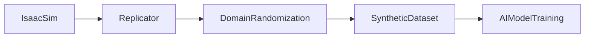
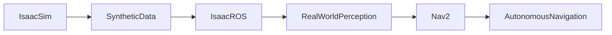

# Chapter 1: NVIDIA Isaac Sim

## Learning Objectives

- Identify the four technology pillars that make Isaac Sim different from traditional robotics simulators.
- Explain what synthetic data is and why it solves the real-world data collection problem for AI training.
- Describe what the Replicator tool does and name the four categories of domain randomization it applies.
- Compare Isaac Sim and Gazebo and select the appropriate simulator for a given robotics task.

:::info Prerequisites

This chapter assumes you have completed:

- [Module 1: Humanoid Robotics and ROS 2](../module-1-ros2/index.md) — robot hardware and ROS 2 fundamentals
- [Module 2: The Digital Twin](../module-2-digital-twin/index.md) — physics simulation and digital twin concepts

:::

## What is NVIDIA Isaac Sim?

NVIDIA Isaac Sim is a photorealistic robotics simulator built on top of the NVIDIA Omniverse platform. Where Gazebo is optimized for physics accuracy and ROS 2 integration, Isaac Sim is optimized for producing training data that looks and behaves like the real world. It achieves this through four technology pillars:

**Omniverse** is NVIDIA's collaborative simulation platform. It provides the runtime environment, the asset pipeline, and the real-time collaboration infrastructure that Isaac Sim runs on. Teams can connect to the same Omniverse scene simultaneously and see updates in real time.

**USD (Universal Scene Description)** is the scene file format developed by Pixar and extended by NVIDIA. USD describes every object in the simulation — its geometry, materials, physics properties, and semantic labels — in a single, interoperable file format. USD scenes can be shared between Isaac Sim, other Omniverse applications, and external tools without conversion.

**RTX (Ray Tracing Extension)** is NVIDIA's real-time ray tracing renderer. Unlike the rasterization renderers used in Gazebo and most game engines, RTX traces the physical path of light rays through the scene. This produces physically accurate reflections, shadows, subsurface scattering, and lens effects — making synthetic images nearly indistinguishable from photographs.

**PhysX** is NVIDIA's GPU-accelerated physics engine. It simulates rigid body dynamics, articulated joints, contact forces, friction, and soft bodies at GPU speeds. For robotics, this means robot joint dynamics, ground contact, and object interactions are physically accurate enough to transfer to real hardware.

Together, these four pillars enable Isaac Sim to produce images that AI models can train on and then apply to real cameras — a property called sim-to-real transfer.

## Isaac Sim vs Gazebo

The two simulators serve different purposes and are often used together in the same robotics pipeline.

| Dimension | Isaac Sim | Gazebo |
|---|---|---|
| Rendering | RTX ray tracing, PBR materials, photorealistic | Rasterization, basic materials, functional |
| Physics engine | PhysX (GPU-accelerated) | ODE / Bullet / DART (CPU-based) |
| Scene format | USD (Universal Scene Description) | SDF (Simulation Description Format) |
| AI training | Replicator synthetic data pipeline built-in | No built-in synthetic data tooling |
| ROS 2 integration | Via Isaac ROS bridge (ROS 2 control bridge) | Native (gz-ros2-control, sensor plugins) |
| Hardware requirement | NVIDIA GPU required (RTX 3080 or better) | CPU-based; GPU optional |

**When to use Isaac Sim**: Generating synthetic training data for AI perception models; photorealistic sensor simulation; sim-to-real transfer research.

**When to use Gazebo**: Functional robot testing; rapid prototyping; environments where GPU hardware is unavailable; native ROS 2 sensor simulation.

## Why Synthetic Data?

Training a perception model — an object detector or a depth estimator — requires thousands to millions of annotated images. Each image needs ground-truth labels: bounding boxes, segmentation masks, depth values, surface normals. Collecting this data from the real world creates three problems:

1. **Cost**: Hiring humans to annotate real images is expensive. A dataset of one million images can cost hundreds of thousands of dollars to label.
2. **Time**: Collecting diverse real-world data across different lighting conditions, environments, and object configurations takes months or years.
3. **Danger**: Training data for robots operating in hazardous environments — construction sites, disaster zones, surgery rooms — cannot be collected safely.

Synthetic data solves all three problems. Isaac Sim generates images with automatic, pixel-perfect ground-truth annotations at the moment of rendering — no human labeling required. It runs faster than real time, so one GPU can produce thousands of annotated images per hour. And it can simulate environments that would be impossible or dangerous to visit in person.

The remaining challenge is the domain gap — the difference in visual appearance between synthetic images and real photographs. Isaac Sim's Replicator tool is designed specifically to close this gap through domain randomization.

## Replicator: Domain Randomization

Replicator is Isaac Sim's Python-scriptable synthetic data generation tool. Its core technique is domain randomization: randomly varying scene parameters each time an image is rendered, so that the AI model trained on synthetic data cannot overfit to any specific lighting, texture, or object placement.

Replicator varies four categories of scene parameters:

1. **Lighting**: Intensity, color temperature, position, and number of light sources. A model trained with randomized lighting generalizes to offices, warehouses, and outdoor environments without retraining.
2. **Materials**: Surface textures, reflectivity, roughness, and color of every object in the scene. This prevents the model from relying on a specific texture to recognize an object.
3. **Object poses**: Position and rotation of objects in the scene. The model sees every object from every angle and at every distance.
4. **Camera parameters**: Position, viewing angle, field of view, and focal length. This covers variation in camera mounting and calibration across different robot platforms.

### Label Types

Replicator writes ground-truth annotations alongside each rendered image. The available label types are:

| Label Type | Description |
|---|---|
| Bounding Box 2D | Axis-aligned rectangle around each object in image coordinates |
| Bounding Box 3D | Oriented 3D box around each object in world coordinates |
| Semantic Segmentation | Pixel-level class label (every pixel assigned to an object class) |
| Instance Segmentation | Pixel-level instance label (each individual object gets a unique ID) |
| Depth | Per-pixel distance from the camera to the surface |
| Surface Normals | Per-pixel orientation of the surface relative to the camera |

### Replicator Configuration Example

```yaml
# Isaac Sim Replicator -- domain randomization configuration
replicator:
  output_dir: /dataset/synthetic_v1   # where images and labels are saved
  frames: 10000                        # total number of frames to generate

  randomizers:
    lighting:
      intensity_min: 200               # minimum light intensity (lux)
      intensity_max: 2000              # maximum light intensity (lux)
      color_temperature_min: 2700      # warm (incandescent)
      color_temperature_max: 6500      # cool (daylight)

    materials:
      texture_pool: /assets/textures/  # directory of randomized surface textures
      roughness_min: 0.1               # highly reflective
      roughness_max: 0.9               # fully matte

    poses:
      translation_range: [-1.0, 1.0]  # meters, XYZ each axis
      rotation_range: [-180, 180]      # degrees, full rotation

    camera:
      distance_min: 0.5                # meters from target object
      distance_max: 3.0                # meters from target object
      elevation_min: -30               # degrees below horizontal
      elevation_max: 60                # degrees above horizontal
```

## Where Isaac Sim Fits in the Pipeline

Isaac Sim is the first stage of the NVIDIA Isaac AI pipeline. It generates the synthetic training data that AI perception models learn from. Once trained, those models are deployed inside Isaac ROS (Chapter 2), which runs them on live sensor data from the real robot in real time.



The trained AI model then moves into the Isaac ROS perception pipeline — connecting the simulation world of Chapter 1 to the real-world perception system of Chapter 2.



## Summary

| Term | Definition |
|---|---|
| Isaac Sim | NVIDIA's photorealistic robotics simulator built on Omniverse; used to generate synthetic training data for AI perception models |
| Omniverse | NVIDIA's collaborative simulation platform that Isaac Sim runs on; provides the real-time rendering and asset pipeline |
| USD | Universal Scene Description — the scene file format used by Isaac Sim; describes geometry, materials, physics, and semantic labels |
| RTX | NVIDIA's real-time ray tracing renderer; produces photorealistic images by simulating the physical path of light |
| Replicator | Isaac Sim's domain randomization tool; generates diverse synthetic datasets by varying lighting, materials, poses, and camera parameters |
| Synthetic Data | Photorealistic, automatically annotated training data generated by a simulator; eliminates the cost and risk of real-world data collection |
| Domain Randomization | A technique that varies scene parameters randomly during synthetic data generation so AI models generalize to real-world conditions |
