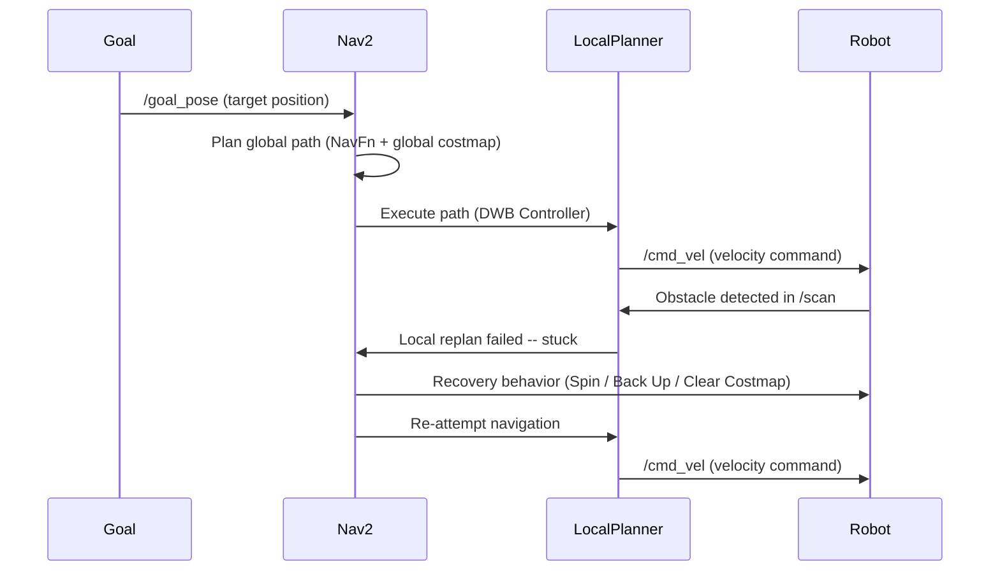

# Chapter 3: Navigation with Nav2

## Learning Objectives

- Explain the difference between the global costmap and the local costmap and describe when each is used.
- Describe how the NavFn global planner computes a path and how the DWB Controller executes it in real time.
- Read the Nav2 topic interface and identify which topics carry sensor data in and velocity commands out.
- Name the three Nav2 recovery behaviors and explain the situation each behavior is designed to resolve.

:::info Prerequisites

This chapter assumes you have completed:

- [Chapter 2 — Isaac ROS Perception](./chapter-2-isaac-ros.md) — cuVSLAM pose output on `/odom` that Nav2 consumes
- [Module 1: Humanoid Robotics and ROS 2](../module-1-ros2/index.md) — ROS 2 topics and the robot hardware stack

:::

## What is Nav2?

Nav2 — the Navigation 2 stack — is the ROS 2 framework for autonomous robot navigation. It is the successor to the ROS 1 `move_base` package, rebuilt from the ground up for ROS 2's lifecycle management and action server architecture.

Nav2 receives two types of information from the rest of the system:

- A **pose estimate** from cuVSLAM on `/odom` — where the robot currently is
- A **navigation goal** on `/goal_pose` — where the robot should go

It produces one output: a velocity command on `/cmd_vel` — a linear speed and angular rate that the robot's motor controllers execute.

Everything between the goal and the velocity command — costmap maintenance, path planning, obstacle avoidance, and recovery — is Nav2's responsibility.

## Costmaps

Nav2 represents the robot's environment as two costmaps. A costmap is a 2D grid where each cell contains a cost value: 0 for free space, 254 for a lethal obstacle (robot must not enter), and graduated values in between for inflated zones near obstacles.

**Global Costmap** contains the full static map of the environment — typically generated by a SLAM algorithm and loaded from a file. Every cell in the global costmap is marked free, occupied, or unknown based on the static map. The global costmap covers the entire navigable environment and is used by the global planner to compute a complete path from start to goal.

**Local Costmap** is a small rolling window — typically 3 to 5 meters across — centered on the robot and updated continuously from live sensor data on `/scan`. As the robot moves, the local costmap discards old data behind it and incorporates new sensor readings in front. The local costmap captures dynamic obstacles — people, moving objects, furniture rearranged since the map was made — that the static global costmap cannot know about.

**Inflation Radius** is a buffer zone added around obstacles in both costmaps. Instead of treating an obstacle as a single point, Nav2 inflates it outward by the inflation radius (typically 0.5 to 0.6 meters). The inflated zone has graduated cost values — highest near the obstacle, decreasing with distance. This prevents the planner from choosing paths that would require the robot to graze obstacles, providing a safety margin for localization uncertainty.

```yaml
# Nav2 global costmap -- key parameters explained
global_costmap:
  global_frame: map              # coordinate frame of the costmap
  resolution: 0.05               # meters per cell (5 cm grid resolution)
  inflation_radius: 0.55         # buffer zone around obstacles in meters
  update_frequency: 1.0          # Hz -- how often the costmap is refreshed
  publish_frequency: 1.0         # Hz -- how often the costmap is published

local_costmap:
  global_frame: odom             # local costmap is in the robot's odom frame
  rolling_window: true           # window moves with the robot
  width: 5.0                     # meters -- size of the rolling window
  height: 5.0                    # meters -- size of the rolling window
  resolution: 0.05               # meters per cell
  inflation_radius: 0.55         # same buffer zone as global costmap
  update_frequency: 5.0          # Hz -- updated faster than global costmap
```

## Planners and Controllers

Nav2 separates path computation (planning) from path execution (control) into two distinct components.

**NavFn Global Planner** computes the complete path from the robot's current position to the navigation goal. NavFn uses Dijkstra's algorithm applied to the global costmap: it treats the costmap as a weighted graph and finds the lowest-cost path from start to goal, naturally avoiding high-cost obstacle zones and inflated buffers. The global planner runs once when a new goal is received and produces a path — a sequence of waypoints through free space.

**DWB Controller (Dynamic Window Approach B)** executes the path produced by the global planner. The DWB Controller works by sampling: at each control cycle (typically 20 Hz), it generates a set of candidate velocity commands within the robot's dynamic limits (the "dynamic window" — the speeds reachable from the current velocity given the robot's acceleration constraints). For each candidate velocity, it simulates the resulting trajectory forward in time. It then scores each trajectory using a combination of criteria: distance to the goal, alignment with the global path, and clearance from obstacles in the local costmap. The highest-scoring trajectory's velocity command is sent to `/cmd_vel`.

This separation is powerful: the global planner handles long-range optimality; the DWB Controller handles immediate obstacle avoidance and real-time re-planning in the local window.

## Nav2 Topics

| Topic | Direction | Message Type | Purpose |
|---|---|---|---|
| `/map` | Subscribe | `nav_msgs/OccupancyGrid` | Static map from SLAM; populates the global costmap |
| `/odom` | Subscribe | `nav_msgs/Odometry` | Robot pose estimate from cuVSLAM; used for localization |
| `/scan` | Subscribe | `sensor_msgs/LaserScan` | LiDAR data; populates the local costmap with dynamic obstacles |
| `/goal_pose` | Subscribe | `geometry_msgs/PoseStamped` | Navigation goal from the operator or task planner |
| `/cmd_vel` | Publish | `geometry_msgs/Twist` | Velocity command to the robot base; linear and angular speed |

## Obstacle Avoidance and Recovery

When the DWB Controller detects that the planned path is blocked — an obstacle has appeared between the robot and its next waypoint — it first attempts local replanning: it samples a new set of velocity candidates using the updated local costmap and finds a trajectory that avoids the obstacle. For small, static obstacles this local replanning is usually sufficient; the robot smoothly arcs around the obstacle and rejoins the global path.

If local replanning cannot find a valid trajectory — the robot is stuck — Nav2 switches to a recovery behavior. Nav2 2.x ships with three default recovery behaviors implemented as behavior tree nodes:

**Spin**: The robot rotates in place through 360 degrees. This clears sensor artifacts — phantom obstacles caused by sensor noise — and updates the local costmap with a full panoramic view of the immediate surroundings.

**Back Up**: The robot drives backward a short distance (typically 0.3 to 0.5 meters). This unsticks the robot from situations where it has driven into a narrow space and forward progress is blocked.

**Clear Costmap**: Nav2 resets the local costmap, discarding all current obstacle data. This recovers from situations where stale sensor data has incorrectly marked free space as occupied, preventing valid paths from being found.

After each recovery behavior, Nav2 re-attempts navigation to the original goal. If all three recovery behaviors fail in sequence, Nav2 reports a navigation failure to the action server client.

## Nav2 Architecture

```mermaid
graph LR
    GlobalCostmap --> NavFn
    LocalCostmap --> DWBController
    NavFn --> DWBController
    DWBController --> cmdvel[/cmd_vel]
```



## Summary

| Term | Definition |
|---|---|
| Nav2 | The ROS 2 navigation stack; receives pose from cuVSLAM and navigation goals; outputs velocity commands to drive the robot autonomously |
| Global Costmap | A full 2D grid map of the environment; cells marked free, occupied, or unknown; used by the global planner to compute complete paths |
| Local Costmap | A small rolling window around the robot; updated in real time from sensor data; used by the local controller for immediate obstacle avoidance |
| Inflation Radius | A buffer zone added around obstacles in the costmap; prevents the planner from routing paths too close to obstacle edges |
| NavFn | Nav2's global planner; uses Dijkstra's algorithm on the global costmap to compute the lowest-cost path from start to goal |
| DWB Controller | Nav2's local planner (Dynamic Window Approach B); samples velocity candidates, simulates trajectories, and executes the highest-scoring one |
| Recovery Behavior | An action Nav2 takes when stuck: Spin (rotate in place), Back Up (drive backward), or Clear Costmap (reset obstacle data) |
