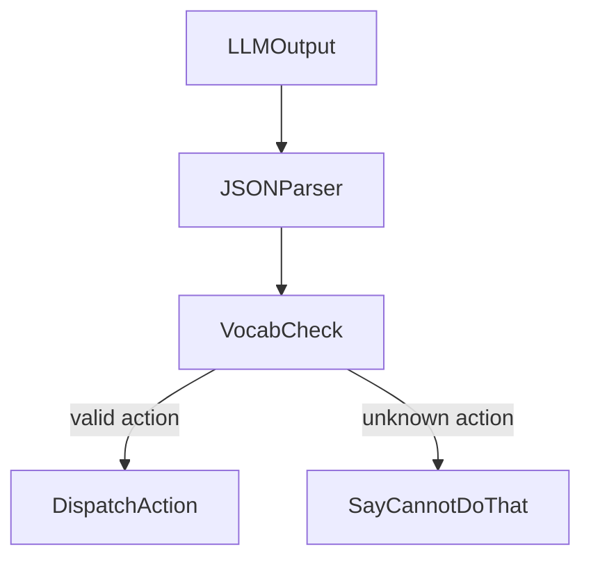
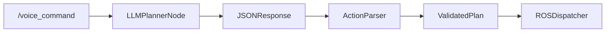

# Chapter 2: Cognitive Planning with LLMs

## Learning Objectives

By the end of this chapter you will be able to:

- Explain why raw LLM output cannot directly drive a robot and why prompt engineering is required
- Construct a four-part system prompt that constrains LLM output to a robot action vocabulary
- Describe structured JSON output and explain how an action parser validates it against a vocabulary
- Map each entry in the action vocabulary to its corresponding ROS 2 topic or service call

---

:::info Prerequisites

This chapter requires:

- **Chapter 1 of this module**: Whisper ASR produces the transcribed text command that the LLM receives as input.

:::

---

## The Planning Problem

When a person says "bring me a glass of water", they are issuing a high-level goal. A robot cannot act on a goal -- it can only execute precise, typed commands. The gap between the two looks like this:

- **Human utterance**: "Bring me a glass of water."
- **What the robot needs**: a sequence of discrete actions -- navigate to the kitchen, locate a glass, pick it up, navigate back to the user, place the glass.

Bridging this gap requires a **planner** that can decompose natural language goals into sequences of typed robot commands. Large Language Models (LLMs) are exceptionally good at this task because they have been trained on vast amounts of text that describes how goals decompose into steps.

The problem is that an LLM is a next-token predictor -- it produces free-form text, not structured robot commands. Without constraints, an LLM might respond to "bring me a glass of water" with "Sure, I will go get that for you!" -- a perfectly reasonable sentence that a robot cannot parse or execute.

This is the planning problem: how do you make an LLM produce output that a robot can actually use?

---

## LLMs as Robot Planners

An LLM becomes a robot planner when you constrain its output format and action space using a **system prompt**. The system prompt is text you inject before the user's message. It tells the LLM:

- What role it is playing (a robot controller, not a conversational assistant)
- What actions are available (the action vocabulary)
- What format its output must follow (structured JSON)
- What to do when it cannot fulfil a request (the safety fallback)

With a well-designed system prompt, the same LLM that writes essays and code becomes a robot planner that reliably outputs executable action sequences.

---

## The Action Vocabulary

The **action vocabulary** is the finite set of robot capabilities the LLM is permitted to generate in its plan. Constraining the LLM to this vocabulary is the single most important safety measure in the VLA pipeline: if the LLM can only name actions that exist, it cannot generate commands the robot does not know how to execute.

| Action | Parameters | ROS 2 Translation |
|---|---|---|
| navigate | location: string | Publish `geometry_msgs/PoseStamped` to `/goal_pose` (Nav2) |
| pick | object: string | Call ROS 2 action server `/arm_controller/pick` |
| place | object: string, location: string | Call ROS 2 action server `/arm_controller/place` |
| open | container: string | Call ROS 2 action server `/arm_controller/open` |
| close | container: string | Call ROS 2 action server `/arm_controller/close` |
| say | message: string | Publish `std_msgs/String` to `/tts_command` |
| wait | seconds: int | Pause execution for the given number of seconds |

Seven actions cover the large majority of household manipulation tasks. Adding more actions increases capability but also increases the surface area for hallucination. Start small.

---

## Prompt Engineering

A system prompt for a robot planner has four parts: role definition, action vocabulary, output format constraint, and safety fallback. Here is an annotated example:

```text
# ROLE
You are a robot controller for a humanoid service robot.
Your job is to convert natural language commands into
structured action sequences the robot can execute.

# AVAILABLE ACTIONS
The robot can only perform these actions:
- navigate(location: string)
- pick(object: string)
- place(object: string, location: string)
- open(container: string)
- close(container: string)
- say(message: string)
- wait(seconds: int)

# OUTPUT FORMAT
Respond ONLY with valid JSON in this exact format:
{
  "actions": [
    {"action": "navigate", "params": {"location": "kitchen"}},
    {"action": "pick",     "params": {"object": "water_glass"}}
  ]
}
Do not add explanation. Do not add markdown. JSON only.

# SAFETY
If the command is unclear, dangerous, or requires an action
not in your vocabulary, respond with:
{"actions": [{"action": "say", "params": {"message": "I cannot do that."}}]}
```

Each section serves a distinct purpose:

- **ROLE**: Anchors the LLM in the robot controller context and prevents conversational responses.
- **AVAILABLE ACTIONS**: Explicitly lists the vocabulary. The LLM has seen millions of examples of action lists -- this format is familiar and reliably constrains output.
- **OUTPUT FORMAT**: Shows the exact JSON schema with a concrete example. LLMs that have been fine-tuned for instruction-following will reproduce this schema precisely.
- **SAFETY**: Provides a safe fallback. Without this, an LLM asked to do something impossible might generate a creative but invalid response.

---

## Structured Output: JSON

With the system prompt above, the LLM response to "Pick up the red cube and bring it to me" looks like this:

```json
{
  "actions": [
    {"action": "navigate",  "params": {"location": "table"}},
    {"action": "pick",      "params": {"object": "red_cube"}},
    {"action": "navigate",  "params": {"location": "user"}},
    {"action": "place",     "params": {"object": "red_cube", "location": "user_hands"}},
    {"action": "say",       "params": {"message": "Here is the red cube."}}
  ]
}
```

This is **structured output**: the LLM response conforms to a defined schema (JSON with an `actions` array of typed objects) so it can be parsed programmatically. The robot controller does not need to understand natural language -- it just needs to parse JSON and look up action names.

---

## The Python Action Parser

The action parser is the software layer that sits between the LLM and the ROS 2 dispatcher. It does two things:

1. Parses the JSON response from the LLM
2. Validates each action name against the known vocabulary

```python
import json

# The complete set of valid action names
VALID_ACTIONS = {"navigate", "pick", "place", "open", "close", "say", "wait"}

def parse_action_plan(llm_response):
    # Step 1: parse JSON -- if the LLM produced invalid JSON, catch the error
    try:
        plan = json.loads(llm_response)
        actions = plan.get("actions", [])
    except (json.JSONDecodeError, AttributeError):
        # JSON parse failed -- return safe fallback immediately
        return [{"action": "say", "params": {"message": "Planning error. Please repeat."}}]

    # Step 2: validate each action name against the vocabulary
    validated = []
    for step in actions:
        action_name = step.get("action", "")
        if action_name not in VALID_ACTIONS:
            # Unknown action -- reject the entire plan and say so
            return [{"action": "say", "params": {"message": "I cannot do that."}}]
        validated.append(step)

    return validated
```

The parser is intentionally strict: if a single step contains an unknown action name, the entire plan is rejected and replaced with the safe fallback. This prevents a partially valid plan from sending the robot into an undefined state.

---

## The Hallucination Guardrail

LLMs can **hallucinate** -- produce plausible-sounding but incorrect output. In a conversational context, a hallucination might be a wrong fact. In a robotics context, a hallucination might be an action name the robot does not have, like `"grab"` instead of `"pick"`, or `"sprint_to"` instead of `"navigate"`.

The action parser is the hallucination guardrail. Without it, a single malformed LLM response could cause the ROS 2 dispatcher to receive an action it has no handler for -- which would either crash the dispatcher or, worse, cause undefined behavior on hardware.



This guardrail is not optional. It is a hard requirement for any VLA system that runs on real hardware.

---

## ROS 2 Action Translation

Once the action parser returns a validated plan, the **ROS 2 dispatcher** translates each action into the appropriate ROS 2 call:

| Action | ROS 2 Interface | Message Type |
|---|---|---|
| navigate | publish to `/goal_pose` | `geometry_msgs/PoseStamped` |
| pick | call action server `/arm_controller/pick` | custom action |
| place | call action server `/arm_controller/place` | custom action |
| say | publish to `/tts_command` | `std_msgs/String` |
| wait | `rclpy.spin_once` with timer | built-in |

The dispatcher is a straightforward mapping: for each validated action in the plan, look up the action name in a dispatch table and call the corresponding ROS 2 interface with the provided parameters.

---

## LLM Planning Pipeline



The planner node subscribes to `/voice_command`, sends the transcription plus the system prompt to the LLM, receives a JSON response, parses and validates it, then hands the validated plan to the ROS 2 dispatcher. Each step is synchronous -- the next step does not start until the previous one completes.

---

## Summary

| Term | Definition |
|---|---|
| LLM Planner | Interprets a natural language command and decomposes it into a structured action sequence |
| System Prompt | Pre-conversation instructions that define the LLM's role, output format, action vocabulary, and safety fallback |
| Action Vocabulary | The finite set of robot capability names the LLM is permitted to generate |
| Structured Output | An LLM response constrained to a defined JSON schema so it can be parsed programmatically |
| Hallucination Guardrail | The vocabulary check in the action parser that rejects any action name not in the vocabulary |
| Action Parser | The software layer that parses LLM JSON output and validates action names against the vocabulary |
| ROS 2 Translation | The mapping from action vocabulary entries to ROS 2 topics, services, or action servers |

---

**Next**: [Chapter 3 -- Autonomous Humanoid Capstone →](./chapter-3-capstone.md)
