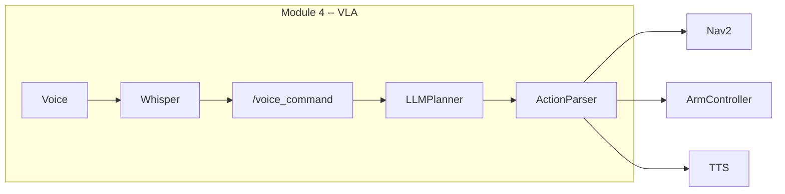
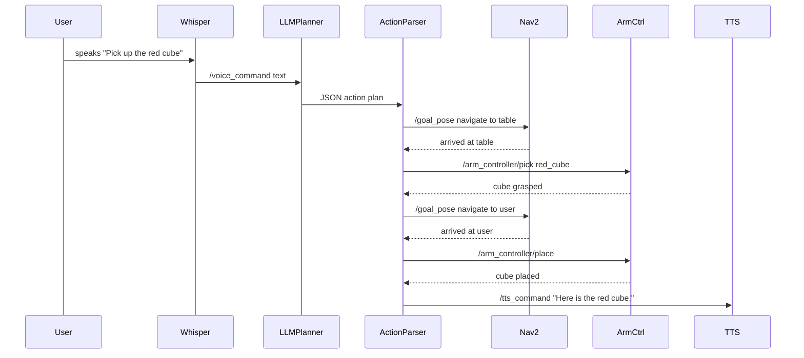

# Chapter 3: Autonomous Humanoid Capstone

## Learning Objectives

By the end of this chapter you will be able to:

- Trace the complete VLA data flow from a spoken command to a physical robot action, naming the component at each step
- Identify which module (1, 2, 3, or 4) is responsible for each layer of the autonomous humanoid pipeline
- Explain how the hallucination guardrail operates in the context of the full end-to-end system
- Describe what makes integration more complex than the sum of its individual parts

---

:::info Prerequisites

This chapter requires all prior content:

- **Module 1 -- ROS 2 Foundations**: ROS 2 topics, action servers, and the `rclpy` API
- **Module 2 -- The Digital Twin**: Gazebo simulation environment for testing the full pipeline
- **Module 3 -- The AI-Robot Brain**: Isaac ROS object detection, cuVSLAM pose estimation, and Nav2 navigation
- **Chapter 1 (this module)**: Whisper ASR -- converts speech to text on `/voice_command`
- **Chapter 2 (this module)**: LLM planner, action vocabulary, action parser, and hallucination guardrail

:::

---

## The VLA Capstone

You have built four modules. Each module added one layer to the stack:

- **Module 1** gave the robot a communication nervous system: ROS 2 topics, action servers, and typed messages.
- **Module 2** gave the robot a body to test in: a Gazebo digital twin where changes are free and crashes have no consequences.
- **Module 3** gave the robot eyes and legs: Isaac ROS perception for seeing objects and cuVSLAM for knowing where the robot is, with Nav2 for autonomous navigation.
- **Module 4** is giving the robot a voice and a mind: Whisper to hear commands and an LLM planner to reason about what to do.

Integration is harder than the sum of the parts because each component has assumptions about timing, message formats, and ordering that only surface when they are all running together. A navigation action must complete before a pick action can start. The object detection result must be available before the arm controller can target the object. The LLM plan must be validated before any ROS 2 calls are made.

This chapter traces one scenario end-to-end so you can see exactly how these components interact.

---

## System Architecture

The full VLA pipeline has four layers, one per module. Each layer exposes a ROS 2 interface (topic or action server) that the layer above it calls.



The Module 4 layer is the orchestrator: it receives voice input, produces a validated action plan, and dispatches each action to the correct downstream ROS 2 interface. Nav2 (Module 3), the arm controller (Module 1), and the TTS node (Module 4) are all downstream consumers.

---

## Capstone Scenario: "Pick Up the Red Cube"

The scenario: a user says "Pick up the red cube." The robot is standing in a room. A red cube is on a table across the room. The user is standing nearby.

| Step | Component | Module | Input | Output |
|---|---|---|---|---|
| 1 | Microphone + Whisper | Module 4, Ch 1 | Audio from microphone | `/voice_command`: "Pick up the red cube." |
| 2 | LLM Planner Node | Module 4, Ch 2 | `/voice_command` text + system prompt | JSON action plan (navigate, pick, navigate, place, say) |
| 3 | Action Parser | Module 4, Ch 2 | JSON action plan | Validated list of ROS 2 action calls |
| 4 | Nav2 | Module 3, Ch 3 | `/goal_pose` -- table location | Robot navigates from start position to the table |
| 5 | Isaac ROS cuVSLAM | Module 3, Ch 2 | Camera frames during navigation | `/odom` -- robot pose updated in real time |
| 6 | Isaac ROS Object Detection | Module 3, Ch 2 | `/camera/image_raw` at table | `/object_detections` -- red cube position in world frame |
| 7 | Arm Controller | Module 1 | `/arm_controller/pick` -- object: red_cube | Arm extends, fingers close, cube grasped |
| 8 | Nav2 | Module 3, Ch 3 | `/goal_pose` -- user location | Robot navigates from table to user |
| 9 | Arm Controller | Module 1 | `/arm_controller/place` -- location: user_hands | Arm extends, fingers open, cube released |
| 10 | TTS Node | Module 4 | `/tts_command` -- "Here is the red cube." | Robot speaks the confirmation message |

Ten steps. Five ROS 2 interfaces. Four modules. Each step depends on the previous one completing successfully -- this is why integration testing the full pipeline matters.

---

## Full Execution Sequence



The Action Parser is the central coordinator: it dispatches each action in sequence, waits for a completion signal (the `-->>` return arrows), and only then dispatches the next action. This synchronous dispatch pattern ensures that navigation completes before manipulation begins.

---

## Module Contribution Map

Each module contributes exactly one layer to the unified VLA pipeline. No module depends on the one above it in this stack -- only on the ones below it.

| Module | Layer | Contribution to "Pick Up the Red Cube" |
|---|---|---|
| Module 1 | Communication | ROS 2 topics, action servers, and typed messages used by every component |
| Module 2 | Simulation | Gazebo digital twin where the full pipeline can be tested without hardware |
| Module 3 | Perception + Navigation | Isaac ROS object detection locates the cube; cuVSLAM tracks robot pose; Nav2 plans paths |
| Module 4 | Voice + Planning | Whisper hears the command; LLM planner decomposes it; action parser validates and dispatches |

This layered architecture is deliberate. Each module can be tested in isolation, replaced with an alternative (different navigation stack, different ASR engine), and upgraded without breaking the modules above or below it.

---

## The Guardrail in Action

What happens if the user says something the robot cannot do?

**User**: "Dance for me."

**Whisper output**: "Dance for me."

**LLM response** (with the system prompt from Chapter 2):
```json
{"actions": [{"action": "say", "params": {"message": "I cannot do that."}}]}
```

The LLM correctly applies the safety fallback because "dance" is not in the action vocabulary. But what if the LLM hallucinates anyway?

**Hypothetical LLM response** (without a guardrail):
```json
{"actions": [{"action": "perform_dance", "params": {"style": "waltz"}}]}
```

The action parser catches `"perform_dance"` -- it is not in `VALID_ACTIONS`. The parser rejects the entire plan and returns the safe fallback:
```json
[{"action": "say", "params": {"message": "I cannot do that."}}]
```

The robot says "I cannot do that." and stops. No undefined behavior. No crash. The guardrail is a safety property, not just an error handler: it ensures that no matter what the LLM produces, the robot only executes actions it was designed to perform.

---

## Summary

| Term | Definition |
|---|---|
| VLA | Vision-Language-Action -- an AI architecture connecting speech and language understanding to physical robot actions |
| Capstone Pipeline | The end-to-end flow: voice ASR -- LLM planning -- action parsing -- perception -- navigation -- manipulation |
| Action Dispatcher | The component that routes each validated action to the correct ROS 2 topic or action server |
| Manipulation | The arm controller subscribing to `/arm_controller/pick` and `/arm_controller/place` to physically interact with objects |
| TTS | Text-to-speech node that subscribes to `/tts_command` and speaks confirmation messages |
| Guardrail | The vocabulary check in the action parser that rejects any action name not in `VALID_ACTIONS` |
| Module Integration | Each module contributes one layer: communication, simulation, perception+navigation, voice+planning |
