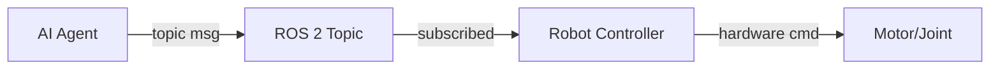

# Data Model: Module 1 — The Robotic Nervous System (ROS 2)

**Branch**: `001-module1-ros2` | **Date**: 2026-03-07
**Phase**: 1 — Design & Contracts

This document describes the content structure model for the Docusaurus book.
There is no relational or vector database in this phase — the "data model" is
the schema of static content files.

---

## Entity 1: Module (Directory)

A Module is a Docusaurus docs directory representing one book module.

**Location**: `book/docs/<module-slug>/`

**Files**:
- `_category_.json` — Docusaurus sidebar category metadata
- `index.md` — Module landing page

**`_category_.json` schema**:
```json
{
  "label": "Module 1: The Robotic Nervous System",
  "position": 1,
  "collapsible": true,
  "collapsed": false,
  "description": "Short description shown in sidebar tooltip"
}
```

**`index.md` frontmatter**:
```yaml
---
id: module-1-overview
title: "Module 1: The Robotic Nervous System"
sidebar_position: 0
description: "Overview of ROS 2 as the middleware connecting AI software with robot hardware."
---
```

**Validation rules**:
- `position` MUST be a unique integer within the parent docs directory.
- `label` MUST match the module's canonical title.
- `index.md` MUST exist in every module directory.

---

## Entity 2: Chapter (MDX File)

A Chapter is a Docusaurus MDX page representing one topic area within a module.

**Location**: `book/docs/<module-slug>/chapter-<N>-<slug>.md`

**Frontmatter schema**:
```yaml
---
id: chapter-<N>-<slug>          # Unique ID, used for cross-links
title: "Chapter N — <Title>"    # Full chapter title
sidebar_position: <N>           # Integer; controls order in sidebar (1-based)
description: "<One-sentence summary for SEO and sidebar tooltip>"
tags:
  - ros2
  - robotics
  - module-1
---
```

**Body structure** (ordered, all sections MUST be present):
```markdown
## Learning Objectives

- Understand [concept 1]
- Explain [concept 2]
- Apply [concept 3]

## <Section 1 Title>

[Prose content]

### <Subsection if needed>

[Content]

## <Section 2 Title>

[Prose content + optional code block or diagram]

...

## Summary

| Concept | Key Takeaway |
|---------|-------------|
| [term]  | [one-line description] |
```

**Validation rules**:
- `sidebar_position` MUST be unique within its parent directory.
- `id` MUST be unique across all docs.
- Body MUST begin with `## Learning Objectives` section.
- Body MUST end with `## Summary` section containing a takeaway table.
- Every technical term MUST be defined in the section where it first appears.
- At least one Mermaid diagram or code block MUST appear between Learning Objectives
  and Summary.

---

## Entity 3: Code Example (Fenced Code Block)

A Code Example is a fenced Markdown code block embedded within a Chapter.

**Format**:
````markdown
```python title="publisher_node.py" showLineNumbers
# ROS 2 Humble — rclpy publisher example
import rclpy
from rclpy.node import Node
from std_msgs.msg import String

class MinimalPublisher(Node):
    ...
```
````

**Attributes**:
- `title`: Filename or label shown above the code block (required for all examples)
- `showLineNumbers`: Always present for multi-line examples (>5 lines)
- Language tag: `python` for rclpy examples; `xml` for URDF; `bash` for shell commands

**Validation rules**:
- All `python` code blocks MUST pass `python -m py_compile` (syntax only).
- All `xml` code blocks tagged as URDF MUST pass `xmllint --noout`.
- Every code block MUST have a `title` attribute.
- All rclpy examples MUST include a comment noting ROS 2 Humble compatibility.

---

## Entity 4: Diagram (Mermaid Block)

A Diagram is a Mermaid code block embedded within a Chapter, rendered at build time.

**Format**:
````markdown

````

**Supported diagram types**:
- `graph LR` / `graph TD` — Architecture and data flow diagrams
- `sequenceDiagram` — Message passing and service call sequences
- `graph TD` with rectangular nodes — URDF link/joint hierarchy

**Validation rules**:
- Every chapter MUST include at least one Mermaid diagram.
- Diagram MUST accurately represent the concept described in the surrounding prose.
- Mermaid syntax MUST be valid (verified by `docusaurus build` compilation).

---

## Module 1 Content Map

| File | `sidebar_position` | Title | Required Sections |
|---|---|---|---|
| `index.md` | 0 | Module 1 Overview | Intro, what you'll learn, prerequisites |
| `chapter-1-intro.md` | 1 | Chapter 1 — Introduction to ROS 2 | LO, Middleware, Why ROS 2, Architecture, Nodes & Topics, Real-world Example, Summary |
| `chapter-2-communication.md` | 2 | Chapter 2 — ROS 2 Communication Model | LO, Nodes Deep Dive, Publishers/Subscribers, Services, rclpy Examples, AI-ROS Interaction, Summary |
| `chapter-3-urdf.md` | 3 | Chapter 3 — Robot Structure & URDF | LO, URDF Fundamentals, Links & Joints, Humanoid Representation, Sample URDF, ROS 2 Integration, Summary |

---

## State Transitions

Chapters follow a simple lifecycle:

```
Draft → Review → Published
```

- **Draft**: MDX file exists but may have placeholder sections.
- **Review**: All sections complete; code examples validated; diagram renders.
- **Published**: Merged to `main`; deployed to GitHub Pages.

Transition gate (Draft → Review):
- `docusaurus build` completes without errors
- No `TODO` or placeholder text remaining in the chapter
- Code examples pass `py_compile` / `xmllint`
- Peer review confirms technical accuracy against ROS 2 Humble docs
